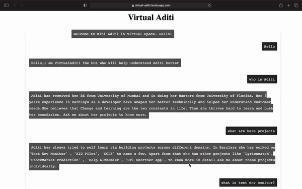

# Virtual Aditi:

This Repo contains rule based chatbot cloning Aditi( Yup That's Me!) using Flask and is deployed on Heroku

## Link
https://virtual-aditi.herokuapp.com

# Libraries Used :
requirements.txt contains all libraries needed, few of them are:
 1. Sci-kit Learn
 2. Flask
 3. Joblib
 4. Keras
 5. Tensorflow
 6. Nltk

# complete application video  : 

# Created By :
Aditi .D. Telang

### References : 
1. https://dev.to/dennismaina/how-to-create-an-ai-chatbot-in-python-and-flask-1c3m
2. https://www.google.com/url?sa=t&rct=j&q=&esrc=s&source=web&cd=&cad=rja&uact=8&ved=2ahUKEwjh4ced6rzwAhWb3jgGHTcvBd4QtwIwAHoECAUQAw&url=https%3A%2F%2Fwww.youtube.com%2Fwatch%3Fv%3DmrExsjcvF4o&usg=AOvVaw0yL-1y3tXJ54MgyAu6QruM

Some steps done to resolve issues while development :

1. H14 error in heroku - “no web processes running”:
     - Added Procfile
2. “error: libhdf5.so: cannot open shared object file: No such file or directory” :
     - hdf5 version is not compatible with default 3.9.x python version and heroku-20 stack. 
     - Hence changed heroku stack from 20 to 18 (command : heroku stack:set heroku-18)
     - Also added runtime.txt with python-3.8.2 version
3. Unable to download nltk corpus (punkt) if only nltk version specified in requirements.txt :
     - Added nltk.txt with corpus
4. ! Compiled slug size: xxx.xM is too large (max is 500M) :
     - Performing cache clear :
        - https://help.heroku.com/KUFMEES1/my-slug-size-is-too-large-how-can-i-make-it-smaller 
        - https://thoughtbot.com/blog/how-to-reduce-a-large-heroku-compiled-slug-size
        - Build :
          - $ heroku plugins:install heroku-builds
          - $ heroku builds:cache:purge -a appname 
     - Tensorflow-2.x.x module is having >300 MB size so I had to replace with tensorflow-cpu. 
  
